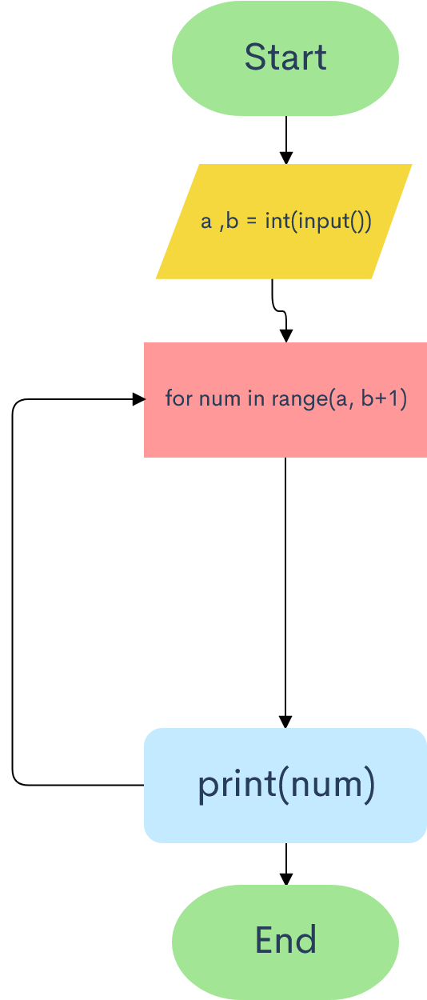
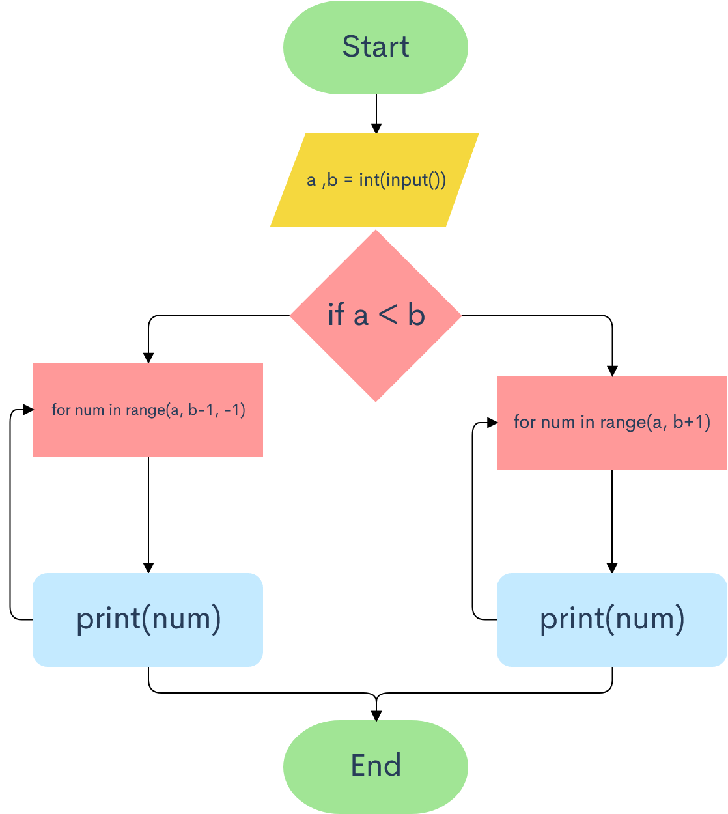
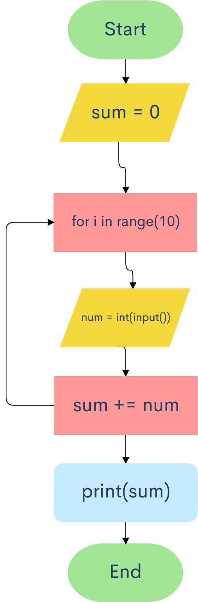
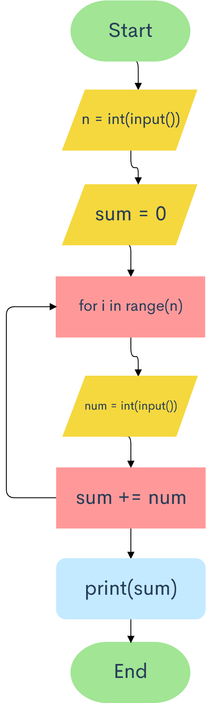
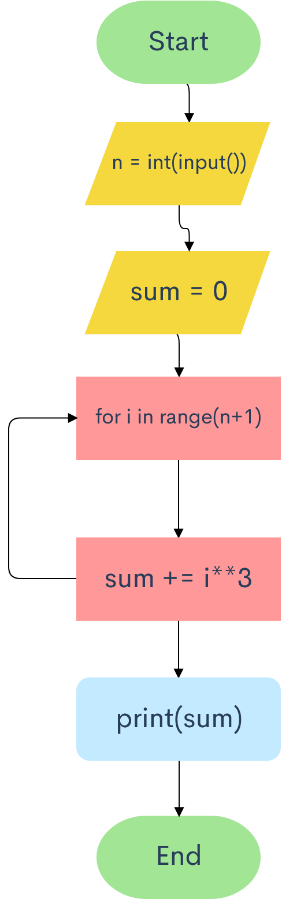

# Snakify chapter 4 exercises - for loop

# 1. Series - 1 


```.py
# Print all integers from a to b inclusively given a <= b
a = int(input("Input a: "))
b = int(input("Input b: "))
for num in range(a, b+1):
  print(num)
```

# 2. Series - 2


```.py
# Print all integers from a to b inclusively, in ascending order if a < b
# or in descending order if a >= b
a = int(input("Input a: "))
b = int(input("Input b: "))
if a < b:
    for num in range(a, b+1):
        print(num)
else:
    for num in range(a, b-1, -1):
        print(num)
```

# 3. Sum of 10 numbers


```.py
# Print the sum of 10 integers given from user
sum = 0
for i in range(10):
    num = int(input("Input number: "))
    sum += num
print(sum)
```

# 4. Sum of N numbers


```.py
# Print sum of n integers, n and the integers are given from user
n = int(input("Input n: "))
sum = 0
for i in range(n):
    num = int(input())
    sum += num
print(sum)
```

# 5. Sum of cubes


```.py
# Given n calculate and print 1**3 + 2**3 + ... + n**3
n = int(input("Input n: "))
sum = 0
for i in range(n+1):
    sum += i**3
print(sum)
```

# 6. Factorial


```.py
# Given n calculate and print n! (n factorial)
n = int(input("Input n: "))
n_fact = 1
for i in range(1, n+1):
    n_fact *= i
print(n_fact)
```

# 7. The number of zeros


```.py
# Given n numbers: the first number in the input is n, after that n integers are given, count the number of zeros
# among the given integers.
n = int(input("Input n: "))
zero_count = 0
for i in range(n):
    num = int(input("Input number: "))
    if num == 0:
        zero_count += 1
print(zero_count)
```

# 8. Adding factorials


```.py
# Given n, calculate and print 1! + 2! + ... + n!
n = int(input())
factorial_sum = 0
current_factorial = 1
for i in range(1, n+1):
    current_factorial *= i
    factorial_sum += current_factorial
print(factorial_sum)
```

# 9. Ladder


```.py
# for given integer n ≤ 9 print a ladder of n steps
# The k-th step consists of the integers from 1 to k without spaces between them
n = int(input())
for i in range(1, n+1):
    for x in range(1, i+1):
        print(x, end="")
    print(" ")
```

# 10. Lost card


```.py

```
