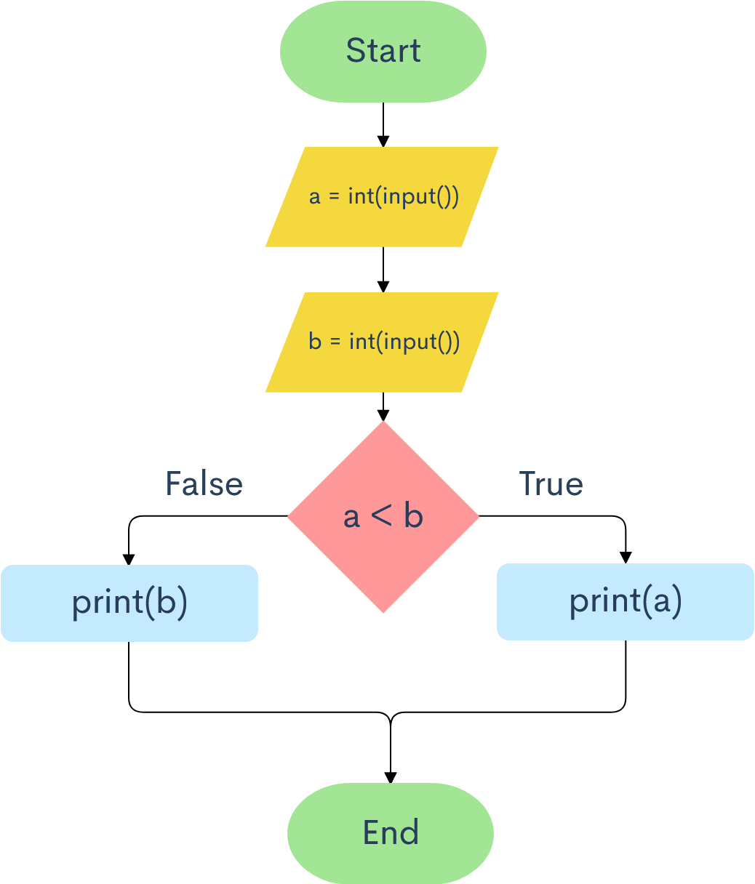
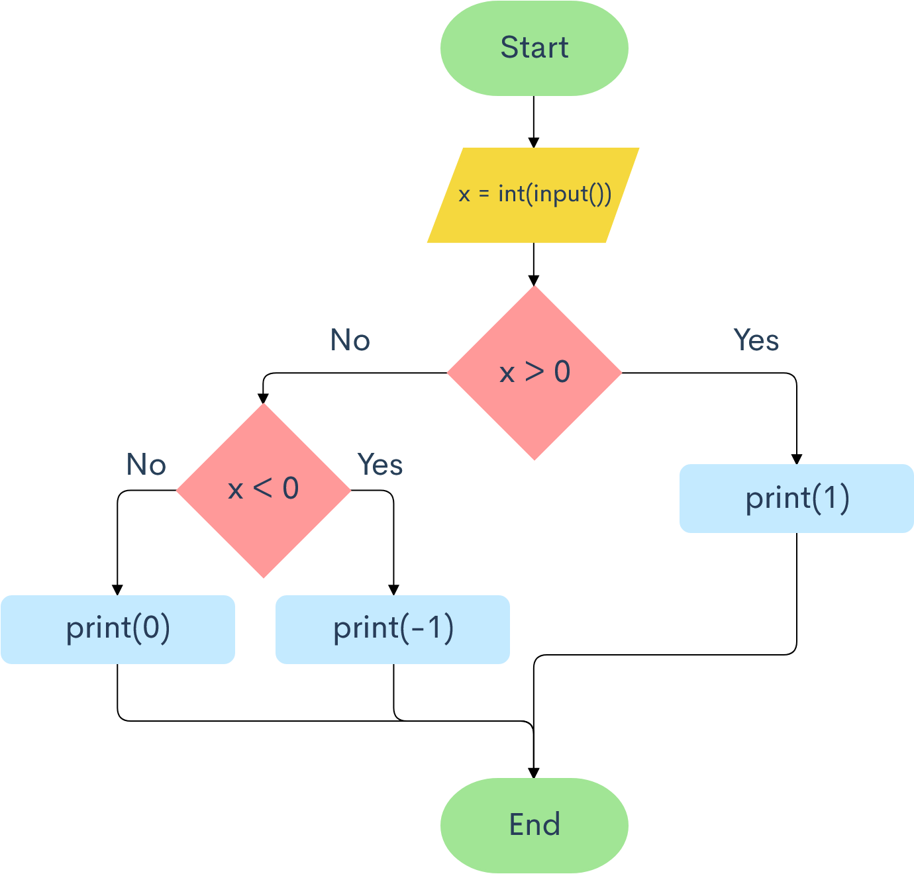
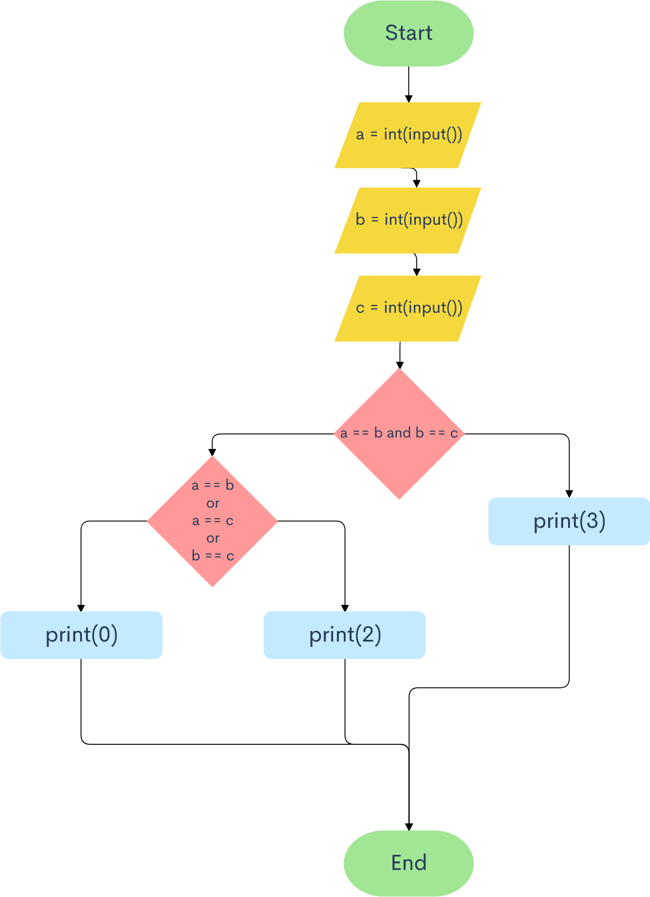
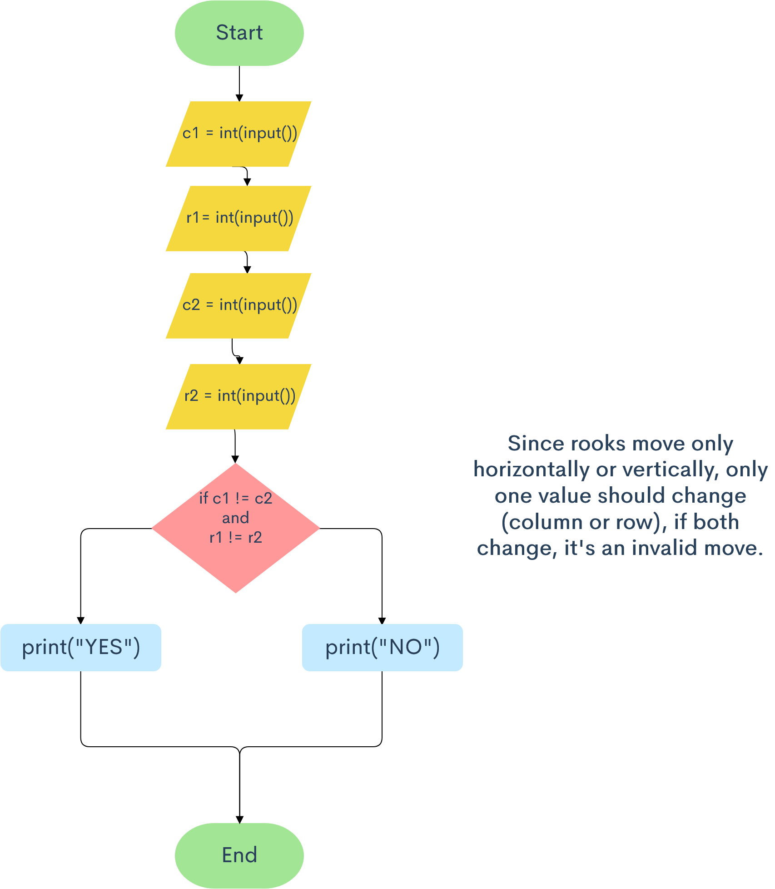
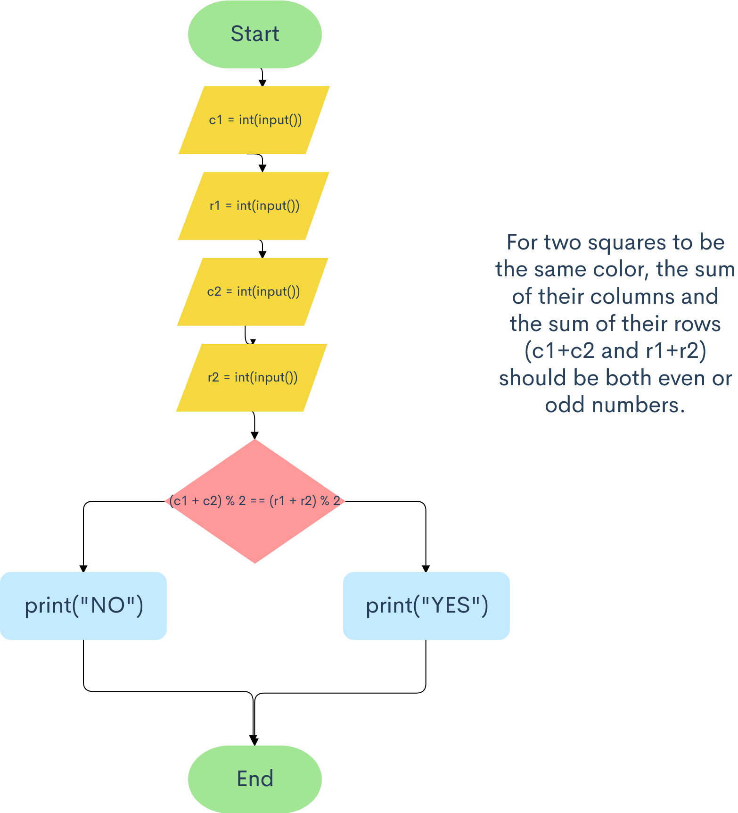
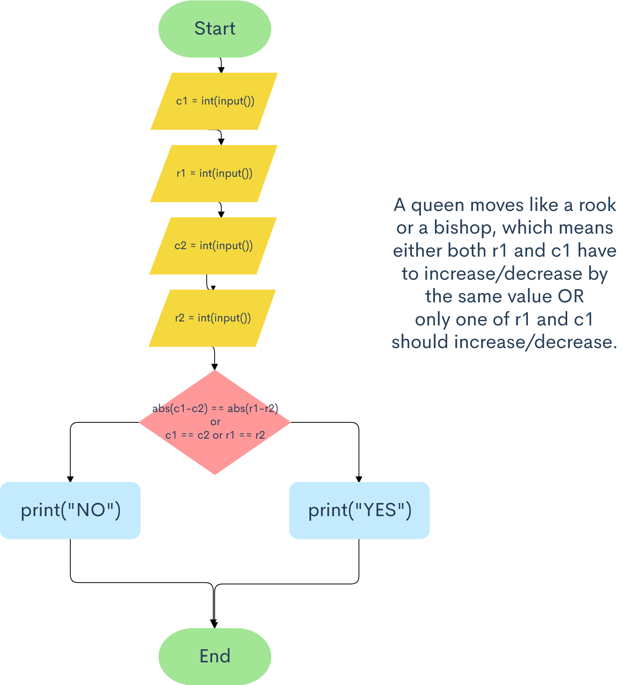
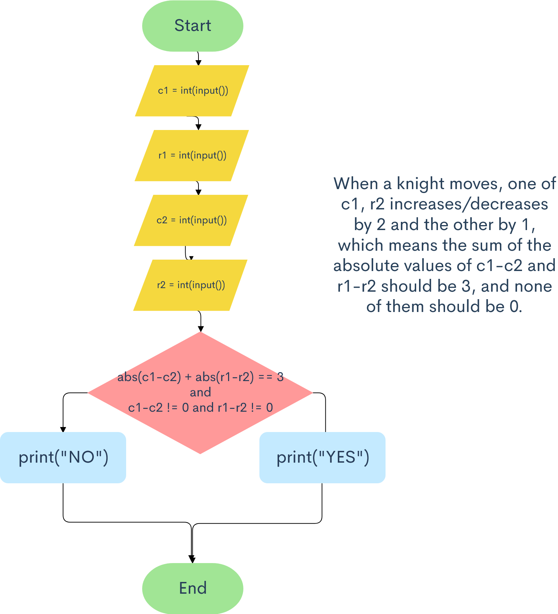
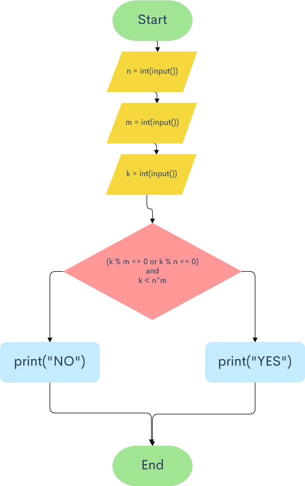
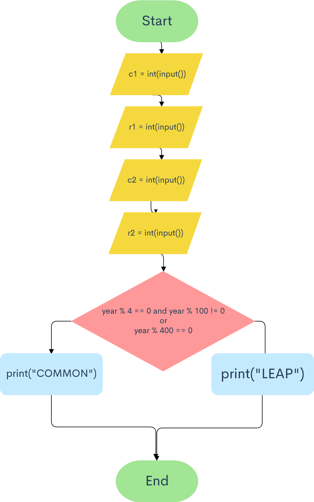

# Snakify chapter 3 exercises

## 1. Minimum of two numbers


```.py
a = int(input())
b = int(input())
if a < b:
    print(a)
else:
    print(b)
```

## 2. Sign function


```.py
x = int(input())
if x > 0:
    print(1)
elif x < 0:
    print(-1)
else:
    print(0)
```

## 3. Minimum of three numbers


```.py
a = int(input())
b = int(input())
c = int(input())
if a < b and a < c:
    print(a)
elif b < a and b < c:
    print(b)
else:
    print(c)
```

## 4. Equal numbers


```.py
a = int(input())
b = int(input())
c = int(input())
if a == b and b == c:
    print(3)
elif a == b or a == c or b == c:
    print(2)
else:
    print(0)
```

# 5. Rook move


```.py
c1 = int(input())
r1 = int(input())
c2 = int(input())
r2 = int(input())
if y1 != y2 and x1 != x2:
    print("NO")
else:
    print("YES")
```

# 6. Chess board - same color


```.py
c1 = int(input())
r1 = int(input())
c2 = int(input())
r2 = int(input())
if (c1 + c2) % 2 == (r1 + r2) % 2:
    print("YES")
else:
    print("NO")
```

# 7. King move 


```.py
c1 = int(input())
r1 = int(input())
c2 = int(input())
r2 = int(input())
if abs(c1-c2) <= 1 and abs(r1-r2) <= 1:
    print("YES")
else:
    print("NO")
```

# 8. Bishop move


```.py
c1 = int(input())
r1 = int(input())
c2 = int(input())
r2 = int(input())
if abs(c1-c2) == abs(r1-r2):
    print("YES")
else:
    print("NO")
```

# 9. Queen move


```.py
c1 = int(input())
r1 = int(input())
c2 = int(input())
r2 = int(input())
if abs(c1-c2) == abs(r1-r2) or c1 == c2 or r1 == r2:
    print("YES")
else:
    print("NO")
```

# 10. Knight move


```.py
c1 = int(input())
r1 = int(input())
c2 = int(input())
r2 = int(input())
if abs(c1-c2) + abs(r1-r2) == 3 and c1-c2 != 0 and r1-r2 != 0:
    print("YES")
else:
    print("NO")
```

# 11. Chocolate bar 


```.py
```

# 12. Leap year


```.py
year = int(input())
if year % 4 == 0 and year % 100 != 0 or year % 400 == 0:
    print("LEAP")
else:
    print("COMMON")
```
