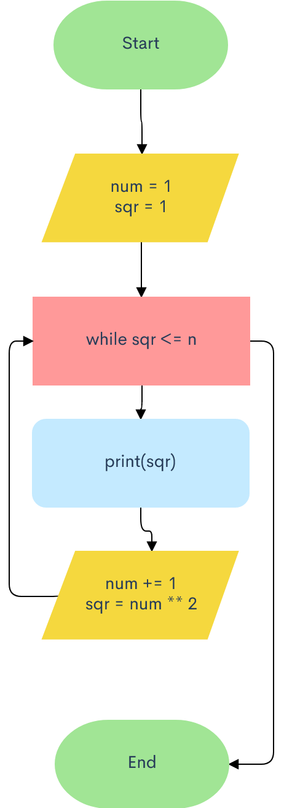
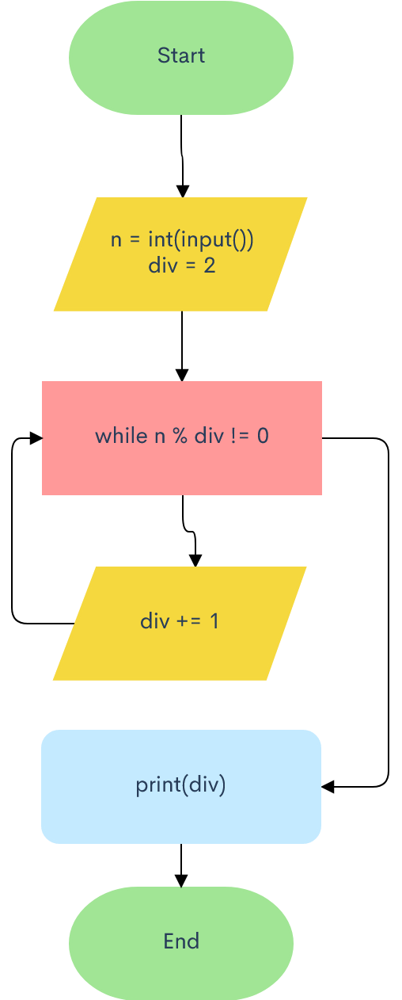
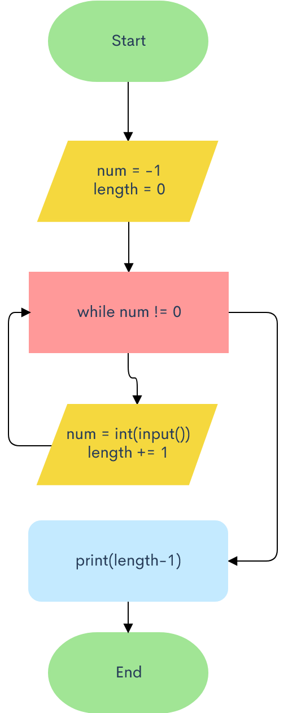
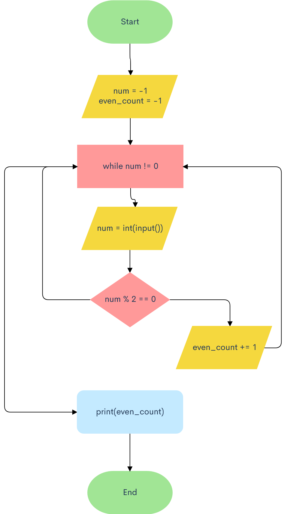

# 1. List of squares


```.py
n = int(input("Input n: "))
num = 1
sqr = 1
while sqr <= n:
    print(sqr)
    num += 1
    sqr = num ** 2
```
```.py
n = int(input("Input n: "))
# i can never be larger than n, if i > n then i**2 > n
for i in range(1, n+1):
    if i**2 <= n:
        print(i**2)
```

# 2. Least divisor


```.py
n = int(input("Input n: "))
div = 2
while n % div != 0:
    div +=　1
print(div)
```
```.py
n = int(input("Input n: "))
div = 2
# The least divisor will never be larger than the number itself
for i in range(1, n+1):
    if n % div != 0:
        div +=1
    else:
        break
print(div)
```

# 3. The power of two


```.py
n = int(input())
exp = 1
res = 2
while res <= n:
    exp += 1
    res *= 2
print(exp-1)
print(res/2)
```
```.py
n = int(input("Input n: "))
exp = 1
res = 2
# No choice but to use very large number
for i in range(1, 10000):
    if res > n:
        break
    else:
        res *= 2
        exp += 1
print(exp-1)
print(res/2)
```


# 4. Morning jog


```.py
x = int(input("Input x: "))
y = int(input("Input y: "))
days = 1
while x < y:
    x += 0.10 * x
    days += 1
print(days)
```
```.py
x = int(input())
y = int(input())
days = 1
# There's nothing we can do here other than use a very large number
for i in range(20000):
    if x >= y:
        break
    else:
        x += 0.10 * x
        days += 1
print(days)
```

# 5. The length of a sequence 


```.py
num = -1
length = 0
while num != 0:
    num = int(input("Input number: "))
    length += 1
print(length-1)
```
```.py
length = 0
for i in range(10000):
    num = int(input("Input number: "))
    if num == 0:
        break
    else:
        length += 1
print(length)
```

# 6. The sum of a sequence


```.py
num = -1
sum = 0
while num != 0:
    num = int(input("Input number: "))
    sum += num
print(sum)
```
```.py
sum = 0
for i in range(10000):
    num = int(input())
    if num == 0:
        break
    else:
        sum += num
print(sum)
```

# 7. The average of a sequence


```.py
num = -1
sum = 0
count = -1
while num != 0:
    num = int(input("Input number: "))
    sum += num
    count += 1
print(sum/count)
```
```.py
sum = 0
count = 0
for i in range(10000):
    num = int(input("Input number: "))
    if num == 0:
        break
    else:
        sum += num
        count += 1
print(sum/count)
```

# 8. The maximum of the sequence


```.py
num = -1
max = 0
while num != 0:
    num = int(input("Input number: "))
    if num > max:
        max = num
print(max)
```
```.py
max = 0
for i in range(10000):
    num = int(input("Input number: "))
    if num == 0:
        break
    else:
        if num > max:
            max = num
print(max)
```

# 9. The index of the maximum of a sequence


```.py
num = -1
max = 0
max_idx = 0
current_idx = 0
while num != 0:
    num = int(input("Input number: "))
    current_idx += 1
    if num > max:
        max = num
        max_idx = current_idx
print(max_idx)
```
```.py
max = 0
max_idx = 0
current_idx = 0
for i in range(10000):
    num = int(input("Input number: "))
    if num == 0:
        break
    else:
        current_idx += 1
        if num > max:
            max = num
            max_idx = current_idx
print(max_idx)
```

# 10. The number of even numbers in a sequence


```.py
num = -1
even_count = -1
while num != 0:
    num = int(input("Input number: "))
    if num % 2 == 0:
        even_count += 1
print(even_count)
```
```.py
even_count = 0
for i in range(10000):
    num = int(input())
    if num == 0:
        break
    else:
        if num % 2 == 0:
            even_count += 1
print(even_count)
```

# 11. The number of elements that are greater than the previous one


```.py
num = -1
count = -1
prev_num = 0
while num != 0:
    num = int(input("Input number: "))
    if num > prev_num:
        count += 1
    prev_num = num
print(count)
```
```.py
count = -1
prev_num = 0
for i in range(10000):
    num = int(input("Input number: "))
    if num == 0:
        break
    else:
        if num > prev_num:
            count += 1
        prev_num = num
print(count)
```

